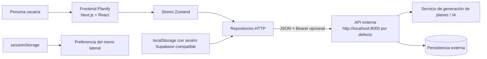
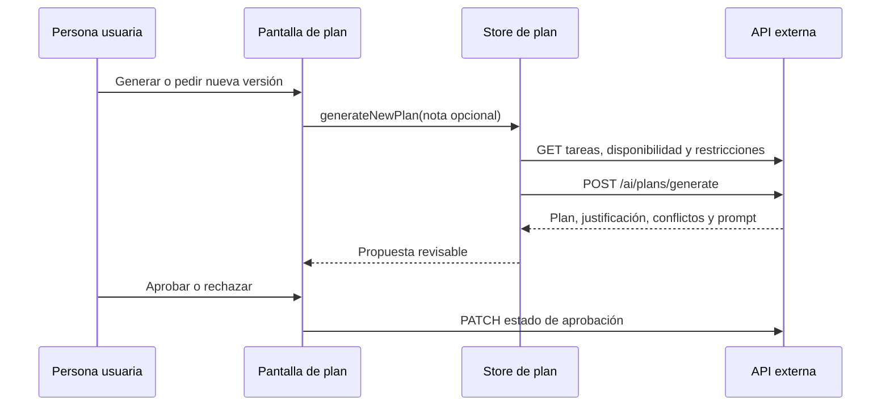
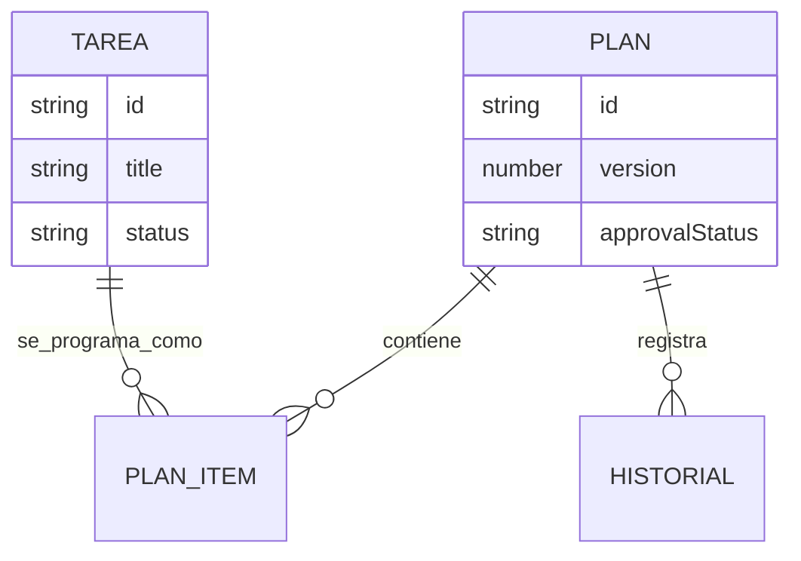

# Planify

Planify es una aplicación web de planificación académica y personal. Permite registrar tareas, disponibilidad semanal y restricciones, y consumir una API que devuelve una propuesta de plan revisable por la persona usuaria. Su objetivo es concentrar el contexto de planificación y presentar una recomendación explicable, editable y aprobable, sin tratarla como una decisión automática.

Está orientada a personas que necesitan organizar tareas académicas, personales, de trabajo o salud. Este repositorio contiene el **frontend**; la persistencia, autenticación real y generación con un modelo de IA se delegan a servicios externos.

## Tabla de contenidos

- [1. Documentación técnica](#1-documentación-técnica)
  - [Arquitectura](#11-arquitectura-del-sistema)
  - [Tecnologías](#12-tecnologías)
  - [Estructura](#13-estructura-del-proyecto)
  - [Configuración](#14-configuración)
  - [Integración de IA](#15-integración-de-ia)
- [2. Documentación funcional](#2-documentación-funcional)
- [3. Manual de usuario](#3-manual-de-usuario)
- [4. Catálogo de prompts](#4-catálogo-de-prompts)
- [5. Guía de ejecución](#5-guía-de-ejecución)
- [6. Evidencia de pruebas](#6-evidencia-de-pruebas)
- [7. Resultados generados](#7-resultados-generados)
- [8. Documentación de la API](#8-documentación-de-la-api)
- [9. Datos y persistencia](#9-datos-y-persistencia)
- [10. Seguridad](#10-seguridad)
- [11. Dependencias](#11-dependencias)
- [12. Notas de desarrollo](#12-notas-de-desarrollo)
- [13. Licencia](#13-licencia)

## 1. Documentación técnica

### 1.1 Arquitectura del sistema

La solución usa Next.js con App Router para el frontend. Las rutas de interfaz residen en `src/app`; las pantallas interactivas son componentes de cliente y mantienen su estado global con Zustand. Los componentes no hacen solicitudes HTTP directamente: consumen *stores*, que delegan en repositorios con interfaces comunes. La composición actual selecciona repositorios HTTP, no los repositorios simulados existentes en `src/lib/services/mock`.



| Capa | Implementación comprobada | Responsabilidad |
|---|---|---|
| Presentación | Next.js, React, componentes UI y Tailwind CSS | Rutas, formularios, tablas, calendario, panel y notificaciones. |
| Estado de cliente | Zustand | Tareas, disponibilidad, plan, historial, vista del plan y preferencia del menú. |
| Acceso a datos | Repositorios HTTP y mapeadores | Convierte tipos de la interfaz a contratos de la API y ejecuta CRUD. |
| API externa | Base configurable con `NEXT_PUBLIC_API_BASE_URL` | Entrega tareas, bloques, restricciones, planes, historial y generación. |
| IA | Endpoint externo `POST /ai/plans/generate` | Genera la propuesta; no hay SDK, modelo ni credenciales de IA en este repositorio. |
| Datos simulados | Clases y semillas en `src/lib/services/mock` | Datos de demostración en memoria; no son la composición activa. |

No se identificaron rutas de API de Next.js, base de datos local, ORM, migraciones, Docker, almacenamiento de archivos ni integración de pagos en el código actual.

#### Autenticación y almacenamiento

Las pantallas de registro e inicio de sesión validan campos localmente y navegan a `/app`; no realizan una autenticación remota. El cliente HTTP busca un token de acceso en `localStorage` dentro de una clave que contenga `sb-` y `auth-token`, con formatos compatibles con sesión de Supabase, y añade `Authorization: Bearer <token>` si lo encuentra. No se identificó inicialización del SDK de Supabase ni gestión de sesión en el repositorio.

La única persistencia de cliente confirmada es el estado de expansión del menú lateral, almacenado por sesión en `sessionStorage` bajo la clave `planify-sidebar`.

### 1.2 Tecnologías

| Tecnología | Versión declarada | Propósito |
|---|---:|---|
| Next.js | 16.2.10 | Framework web y enrutamiento. |
| React / React DOM | 19.2.4 | Construcción de interfaz. |
| TypeScript | ^5 | Tipado estático. |
| Tailwind CSS | ^4 | Estilos utilitarios. |
| Zustand | ^5.0.14 | Estado global del cliente. |
| Base UI | ^1.6.0 | Primitivas de interfaz usadas por componentes UI. |
| shadcn | ^4.13.0 | Configuración y componentes de interfaz. |
| Lucide React | ^1.23.0 | Iconografía. |
| Sonner | ^2.0.7 | Notificaciones. |
| date-fns | ^4.4.0 | Fechas y localización española. |
| next-themes | ^0.4.6 | Dependencia declarada; no se identificó un uso directo. |
| ESLint / eslint-config-next | ^9 / 16.2.10 | Análisis estático. |

### 1.3 Estructura del proyecto

```text
src/
├─ app/                         # Rutas, diseño global y estilos
│  ├─ page.tsx                  # Página de presentación
│  ├─ login/ y registro/        # Formularios de acceso locales
│  └─ app/                      # Área autenticada visualmente
│     ├─ page.tsx               # Panel de seguimiento
│     ├─ plan/                  # Tareas y propuesta de plan
│     ├─ disponibilidad/        # Bloques y restricciones
│     └─ historial/             # Trazabilidad del plan
├─ components/
│  ├─ auth/                     # Marco de formularios de acceso
│  ├─ availability/             # Diálogos de bloques y restricciones
│  ├─ layout/                   # Menú, navegación y encabezados
│  ├─ panel/                    # Indicadores y disponibilidad semanal
│  ├─ plan/                     # Vistas calendario, kanban y tabla
│  ├─ tasks/                    # Formularios, edición y filtros de tareas
│  └─ ui/                       # Componentes de interfaz reutilizables
├─ lib/
│  ├─ ai/                       # Contrato y llamada de generación
│  ├─ constants/                # Días y etiquetas
│  ├─ services/                 # Interfaces, HTTP, mapeos y datos mock
│  └─ types/                    # Tipos de dominio
└─ store/                       # Stores Zustand
public/                         # Logotipos SVG y favicon
```

Los archivos de configuración relevantes son `next.config.ts`, `tsconfig.json`, `eslint.config.mjs`, `postcss.config.mjs` y `components.json`.

### 1.4 Configuración

| Variable | Obligatoria | Propósito | Valor por defecto |
|---|---|---|---|
| `NEXT_PUBLIC_API_BASE_URL` | No | URL base de la API consumida por el navegador. | `http://localhost:8000` |

No existe archivo `.env` versionado. Los archivos `.env*` están ignorados por Git. No se identificaron claves de IA, credenciales de base de datos ni secretos en el código fuente.

`next.config.ts` permite los orígenes de desarrollo `localhost`, `127.0.0.1` y `192.168.56.1`. TypeScript usa modo estricto y el alias `@/*` para `src/*`.

### 1.5 Integración de IA

La interfaz solicita una propuesta mediante `generatePlanProposal`, que envía `scope`, `user_note` y, cuando existe, un bloque de cambio con el identificador y versión del plan anterior a `POST /ai/plans/generate`. Antes de solicitarla, el store recupera tareas, bloques disponibles y restricciones. La respuesta se transforma al tipo `PlanGenerado` y se muestra como propuesta, con justificación, ítems, conflictos, viabilidad y código de validación cuando la API los aporta.



| Aspecto | Hallazgo |
|---|---|
| Proveedor, modelo y SDK | No identificados en el código actual. |
| Prompt de generación | El frontend no construye un prompt textual; la API devuelve `prompt_enviado` y el frontend lo mapea como `promptUsed`. |
| Temperatura, máximo de tokens, herramientas, memoria, RAG y embeddings | No identificados en el código actual. |
| Validación de respuesta | Se mapean campos del contrato. Los estados `response_status`, `viabilidad`, `validation_code` y `estado_revision` se muestran o conservan; no se identificó validación estructural exhaustiva en cliente. |
| Replanificación | La solicitud incorpora el plan anterior y permite una nota libre; la acción visible es “Pedir nueva versión”. |

## 2. Documentación funcional

### Pantallas y flujos identificados

| Pantalla | Propósito y acciones |
|---|---|
| `/` | Presenta Planify y enlaza a inicio de sesión y registro. |
| `/login` | Solicita correo y contraseña, valida formato y campo obligatorio, y navega a `/app`. No autentica contra una API. |
| `/registro` | Solicita nombre, correo, contraseña y confirmación; valida los campos y contraseña mínima de seis caracteres; luego navega a `/app`. |
| `/app` | Panel con distribución por estado y prioridad, tareas próximas, mapa de disponibilidad y alertas del último plan. Permite marcar tareas próximas como completadas. |
| `/app/plan` | Gestiona tareas y revisa el plan. Incluye alta rápida, formulario, edición en línea, filtros, generación, aprobación, rechazo y tres visualizaciones. |
| `/app/disponibilidad` | Crea, edita y elimina bloques de tiempo libre y restricciones; las eliminaciones requieren confirmación. |
| `/app/historial` | Lista fecha, versión, acción, estado, prompt usado y nota de usuario recibidos desde la API. |

### Reglas de negocio observadas

- Una tarea tiene título, descripción, categoría, fecha límite opcional, prioridad, esfuerzo estimado y estado. En el formulario completo son obligatorios título, descripción y esfuerzo positivo; la captura rápida crea una tarea personal, pendiente, de prioridad media y 30 minutos.
- Categorías disponibles: académico, personal, trabajo, salud y otro. Prioridades: baja, media, alta y urgente. Estados: pendiente, en progreso, completada, atrasada y reprogramada.
- Un bloque de disponibilidad requiere día, hora inicial y hora final; el final debe ser posterior al inicio.
- Una restricción requiere descripción. Para horario ocupado o tarea fija exige día y rango horario válido; para tiempo máximo por sesión exige minutos positivos.
- La interfaz refresca el estado del plan y el historial después de modificar tareas, disponibilidad o restricciones.
- La propuesta de plan admite estados `propuesto`, `aprobado`, `editado` y `rechazado`. La UI no la aprueba automáticamente; ofrece acciones explícitas de aprobar y rechazar.
- La tabla priorizada ordena los ítems del plan por prioridad: urgente, alta, media y baja. El calendario muestra siete días y distribuye bloques solapados en carriles.
- En el mapa de disponibilidad, una restricción de horario ocupado o tarea fija prevalece visualmente sobre un bloque libre coincidente.

### Comportamiento esperado y errores

Los formularios muestran errores de validación antes de enviar datos. Al fallar el guardado de tareas, bloques o restricciones se muestran notificaciones. Los errores de generación se presentan en una alerta y reconocen específicamente los códigos `ERR-DATA-001`, `ERR-SYS-001` y `ERR-PLAN-001`; los demás muestran el mensaje recibido. Un plan `no_viable` o `viable_con_ajustes` muestra una advertencia. Los conflictos del plan se muestran en el panel y en la pantalla del plan; los de severidad `critico` usan una variante destructiva.

No se identificó en el cliente una regla que impida aprobar un plan marcado como no viable ni la edición directa de bloques del plan desde las tres vistas. La interfaz declara el estado `editado` y el store contiene `updatePlanItems`, pero ninguna pantalla invoca esa operación actualmente.

## 3. Manual de usuario

### Instalación y configuración

1. Instale Node.js compatible con las dependencias del proyecto.
2. Ejecute `npm install` en la raíz.
3. Opcionalmente, cree `.env.local` con `NEXT_PUBLIC_API_BASE_URL=http://localhost:8000` o con la URL de su API.
4. Inicie la aplicación con `npm run dev` y abra la URL indicada por Next.js.

La API debe estar disponible y cumplir los contratos descritos en [Documentación de la API](#8-documentación-de-la-api) para cargar o modificar información.

### Uso principal

1. En la página inicial seleccione **Crear cuenta** o **Iniciar sesión**. Complete los campos requeridos; al superar la validación se abrirá el panel.
   > Captura de pantalla: Formulario de acceso.
2. Abra **Tareas y Plan**. Use “+ Agregar tarea…” para una tarea rápida o **Nueva tarea** para incluir todos sus datos. También puede editar título, fecha, prioridad, esfuerzo y estado desde la tabla.
   > Captura de pantalla: Tabla de tareas.
3. Abra **Disponibilidad** y agregue sus bloques libres. Después registre horarios ocupados, tareas fijas o un máximo por sesión según corresponda.
   > Captura de pantalla: Bloques y restricciones.
4. Regrese a **Tareas y Plan**, seleccione **Plan propuesto** y pulse **Generar plan**. La interfaz mostrará la propuesta o una alerta de error/viabilidad.
   > Captura de pantalla: Propuesta de plan.
5. Revise la justificación general, conflictos e ítems en **Calendario**, **Kanban** o **Lista priorizada**. Pulse **Aprobar**, **Rechazar** o **Pedir nueva versión** según su decisión.
   > Captura de pantalla: Revisión humana del plan.
6. Consulte **Historial** para revisar los eventos de trazabilidad recibidos desde el servicio.
   > Captura de pantalla: Historial de planes.

Para replanificar, actualice una tarea, bloque o restricción y solicite una nueva versión desde el plan. La actualización de contexto refresca el plan e historial almacenados en la interfaz, pero la generación se inicia explícitamente con el botón.

## 4. Catálogo de prompts

No se identificaron plantillas de prompts dinámicos ni archivos de prompts en el frontend. El único texto de prompt localizado pertenece a las semillas simuladas y al campo de trazabilidad entregado por la API.

| Prompt | Propósito | Versión | Ejemplo de entrada | Ejemplo de salida |
|---|---|---:|---|---|
| `Genera un plan semanal a partir de mis tareas pendientes, disponibilidad y restricciones registradas.` | Semilla mock para representar el prompt usado al generar un plan semanal. | No identificada. | Tareas, bloques disponibles y restricciones. | Plan semanal con ítems y justificación. |
| `prompt_enviado` | Campo del contrato de respuesta de la API, mostrado como “Prompt usado” en historial. | La API no lo especifica. | No aplicable. | Cadena de texto devuelta por la API. |

La solicitud del frontend no transmite el prompt textual: transmite alcance, nota de usuario y referencia opcional al plan previo. La estrategia para generar el texto final del prompt no se identifica en el código actual.

## 5. Guía de ejecución

### Requisitos previos

- Node.js y npm.
- Una API accesible, salvo que se reemplace manualmente la composición de repositorios por las implementaciones mock.

### Comandos disponibles

```bash
npm install
npm run dev
npm run lint
npm run build
npm run start
```

| Comando | Resultado |
|---|---|
| `npm run dev` | Inicia Next.js en modo desarrollo. |
| `npm run lint` | Ejecuta ESLint. |
| `npm run build` | Genera la compilación de producción de Next.js. |
| `npm run start` | Sirve la compilación de producción. |

No se identificaron scripts de migración, semillas de base de datos, pruebas automatizadas ni despliegue. Los archivos de datos mock no se cargan por un script de npm.

## 6. Evidencia de pruebas

No se identificaron archivos ni scripts de pruebas unitarias, de integración o end-to-end.

Durante la inspección se intentó ejecutar `npm.cmd run lint` y `npm.cmd run build`. Ambos comandos iniciaron, pero no pudieron encontrar `eslint` ni `next`, respectivamente, porque `node_modules` no está presente en el directorio de trabajo. Por ello no hay evidencia de una ejecución satisfactoria de lint o build en el estado inspeccionado. Tras `npm install`, deben ejecutarse de nuevo los comandos de la guía.

| Escenario manual derivable | Resultado esperado |
|---|---|
| Crear tarea sin título, descripción o esfuerzo válido | El formulario muestra mensajes de validación y no envía la solicitud. |
| Crear bloque con fin anterior o igual al inicio | Se muestra error de hora final. |
| Crear restricción de sesión sin minutos positivos | Se muestra error de validación. |
| Generar con `ERR-DATA-001` | Se informa que hacen falta tareas o disponibilidad. |
| Recibir plan no viable | Se muestra advertencia y los conflictos recibidos. |
| Eliminar bloque o restricción | Se solicita confirmación antes de enviar la eliminación. |

## 7. Resultados generados

Existen datos de ejemplo en `src/lib/services/mock/seed-data.ts`, pero los repositorios mock no están activos por defecto. Sirven como escenarios de referencia si se conectan manualmente.

| Escenario | Entrada de ejemplo | Resultado representado |
|---|---|---|
| Entrega académica urgente | “Entregar avance de proyecto IA”, 180 min, urgente, fecha en dos días | Se programa el lunes de 18:00 a 19:30 por cercanía y prioridad. |
| Estudio con límite de sesión | Parcial de bases de datos, 120 min, alta; máximo de 90 min por sesión | Se programa el martes de 18:00 a 19:30 y se justifica la división por el límite. |
| Ejercicio ante un horario ocupado | Rutina de ejercicio, 60 min, media; clases el miércoles de 12:00 a 18:00 | Se programa el miércoles de 08:00 a 09:00 para evitar el choque. |

El plan mock contiene una única versión aprobada y dos entradas de historial. No se incluyen escenarios de sobrecarga ni de cambio inesperado como semillas separadas. Las respuestas de IA reales no están incluidas en el repositorio.

## 8. Documentación de la API

La siguiente documentación describe los endpoints que el frontend invoca; no constituye una especificación completa del backend. Todas las solicitudes JSON se envían con `Content-Type: application/json`. Cuando se detecta un token local compatible, se agrega `Authorization: Bearer <token>`.

| Método | Ruta | Uso en frontend |
|---|---|---|
| GET / POST | `/tasks/` | Lista y crea tareas. |
| GET / PATCH / DELETE | `/tasks/{id}` | Consulta, actualiza o elimina una tarea. |
| GET / POST | `/availability/` | Lista y crea bloques de disponibilidad. |
| PATCH / DELETE | `/availability/{id}` | Actualiza o elimina un bloque. |
| GET / POST | `/constraints/` | Lista y crea restricciones. |
| PATCH / DELETE | `/constraints/{id}` | Actualiza o elimina una restricción. |
| GET | `/plans/` | Lista planes. |
| GET | `/plans/latest` | Obtiene el último plan. |
| GET / PATCH | `/plans/{id}` | Consulta un plan o guarda sus ítems. |
| PATCH | `/plans/{id}/approval` | Cambia el estado de aprobación y puede adjuntar una nota. |
| GET | `/plans/history` | Obtiene el historial. |
| POST | `/ai/plans/generate` | Solicita la generación de una propuesta. |

### Contratos relevantes

| Recurso | Campos de solicitud o respuesta usados |
|---|---|
| Tarea | `title`, `description`, `category`, `deadline`, `priority` (numérica), `effort_hours`, `status`. El frontend convierte horas a minutos y prioridades 1/3/4/5 a baja/media/alta/urgente. |
| Disponibilidad | `day`, `start_time`, `end_time`, `label`. |
| Restricción | `type`, `description`, `metadata`. Los metadatos pueden incluir día, inicio, fin y máximo de minutos. |
| Generación | Solicitud: `scope`, `user_note`, `change_block`. Respuesta: identificación, versión, estado, viabilidad, lista `plan`, justificación, conflictos, prompt, estado de respuesta y revisión. |
| Error | Para respuestas no exitosas se interpreta `detail` como texto u objeto con `message` y `code`; de lo contrario se usa “Error de API”. |

No se identificaron códigos de estado documentados por el servidor, paginación, límites de tasa, CORS del backend ni contrato de autenticación del backend.

## 9. Datos y persistencia

No se identificó una base de datos, tablas, relaciones, modelos ORM, migraciones ni esquema de persistencia en este repositorio. Los tipos de dominio que el frontend maneja son:

| Entidad | Relación o contenido |
|---|---|
| `Task` | Tarea con categoría, prioridad, esfuerzo y estado. |
| `AvailabilityBlock` | Bloque libre por día de la semana. |
| `Constraint` | Regla de planificación, opcionalmente horaria o de duración máxima. |
| `PlanGenerado` | Versión de un plan con ítems, conflictos, justificación y estado de revisión. |
| `PlanItem` | Bloque de trabajo de una tarea dentro de un plan. |
| `HistorialEntry` | Evento de trazabilidad asociado a un plan y su versión. |



El diagrama representa relaciones de los tipos del frontend, no un esquema de base de datos confirmado.

## 10. Seguridad

| Área | Hallazgo |
|---|---|
| Secretos | No se encontraron secretos ni claves de IA en el repositorio. `.env*` está ignorado. |
| Autenticación | No hay autenticación real en las pantallas actuales; solo validación local y navegación. |
| Autorización | El cliente puede enviar un Bearer token encontrado en almacenamiento local. Las reglas de autorización del backend no se identificaron. |
| Validación | Los formularios validan campos esenciales y rangos de horas/minutos en cliente. |
| Errores | El cliente normaliza errores HTTP en `ApiError` y muestra alertas o notificaciones. |
| Acciones destructivas | La eliminación de disponibilidad y restricciones requiere confirmación visual. |
| Sesión | Se inspecciona `localStorage` para tokens Supabase-compatible; el menú usa `sessionStorage`. |
| Rate limiting y protección de API | No identificados en el código actual. |

La validación del navegador no sustituye la validación y autorización del servicio. La protección efectiva de datos y tokens depende de la API externa, cuya implementación no está incluida.

## 11. Dependencias

Las dependencias principales se resumen en la sección de tecnologías. Además, `class-variance-authority`, `clsx` y `tailwind-merge` ayudan a componer variantes y clases de estilos, y `tw-animate-css` está declarado para animaciones CSS. Las definiciones de tipos de Node y React, TypeScript, Tailwind y la integración PostCSS están en dependencias de desarrollo.

La versión exacta resuelta de cada paquete se encuentra en `package-lock.json`.

## 12. Notas de desarrollo

- El comentario de arquitectura y los tipos señalan una capa intercambiable de repositorios; sin embargo, `src/lib/services/index.ts` instancia repositorios HTTP. Para usar los mocks hay que cambiar explícitamente esa composición.
- `HttpHistoryRepository.append` devuelve la entrada sin enviarla a la API y no hay una pantalla que lo invoque. La trazabilidad visual depende actualmente de `GET /plans/history`.
- Las operaciones `getById` de tarea y plan capturan cualquier error y devuelven `null`, por lo que la distinción entre “no encontrado” y otro fallo no llega al consumidor.
- Los contratos backend incluyen campos que el frontend no presenta, como `riesgos`, `recomendaciones`, `respuesta_ia` y `modelo_usado`.
- El formulario de acceso es una maqueta funcional de validación; antes de producción requiere integración real, manejo de sesión y controles de autorización.
- La documentación de reglas específicas del algoritmo generativo, modelos, proveedores y persistencia no puede determinarse desde el código fuente actual.

## 13. Licencia

No se identificó un archivo de licencia en el repositorio actual.
